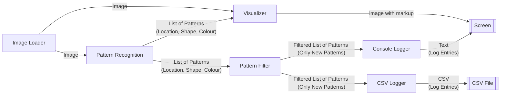

# FHGR B.Sc. MR: SWEng Project (Image Recognition)

This is a mini-project for the software engineering course of the [FHGR B.Sc. Mobile Robotics](https://fhgr.ch/mr),
implemented by [Dominic Eicher](https://github.com/Nic822) and [Ralph Ursprung](https://github.com/rursprung).

This project reads a series of images and tries to recognise different patterns in it, including their colour.
The result is logged (both on the console and in a CSV file) as well as visualised in a GUI.

## Usage
1. To launch the program run `poetry run python3 -m app_stored_images` in the root of this repository
2. Press any key to progress to the next image
3. After the last image the program will terminate

## Architecture Overview

## License

As this is purely an educational project there's no need for others to include it in their commercial works.
Accordingly, this is licensed under the **GNU General Public License v3.0 or later** (SPDX: `GPL-3.0-or-later`).
See [LICENSE](LICENSE) for the full license text.
