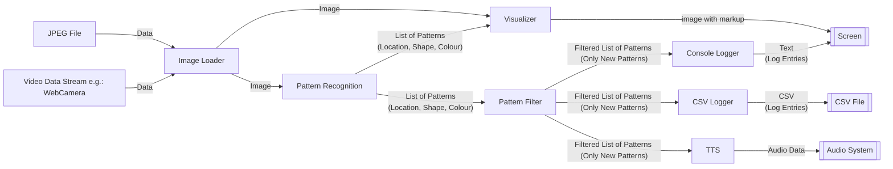

# FHGR B.Sc. MR: SWEng Project (Image Recognition)

[](https://github.com/rursprung/fhgr-sweng-pattern-recognition/actions/workflows/ci.yaml)


This is a mini-project for the software engineering course of the [FHGR B.Sc. Mobile Robotics](https://fhgr.ch/mr),
implemented by [Dominic Eicher](https://github.com/Nic822) and [Ralph Ursprung](https://github.com/rursprung).

This project reads a series of images (either from disk or from a webcam) and tries to recognise different patterns in
it, including their colour.  The result is logged (both on the console and in a CSV file) as well as visualised in a GUI.

## Building & Installing

You need [poetry](https://python-poetry.org/) to properly install this application and run it.
You first need to install the necessary dependencies in the virtual environment:
```bash
poetry install
```

### Distributing & Installing the Application
You can theoretically build a wheel and then install it anywhere - but be real: why would you do this with this application?

Either way, if you really wanted to, you can build a wheel by running:
```bash
poetry build
```

And after that you can take your wheel anywhere and install it:
```bash
python -m pip install dist/fhgr_sweng_pattern_recognition-0.1.0-py3-none-any.whl
```

## Usage

This presumes that you're running this directly from the source using `poetry`. If you have instead installed the
application you can leave away the `poetry run` part of the commands given below.

### Using Stored Images

1. To launch the program run `poetry run python -m app_stored_images` in the root of this repository
2. Press any key to progress to the next image
   * Note: pressing `q` has the special effect of terminating the program instead
3. After the last image the program will terminate

### Using a Webcam

1. To launch the program run `poetry run python -m app_webcam` in the root of this repository
2. Enjoy
3. Press `q` to terminate the program

## Architecture Overview



## License

As this is purely an educational project there's no need for others to include it in their commercial works.
Accordingly, this is licensed under the **GNU General Public License v3.0 or later** (SPDX: `GPL-3.0-or-later`).
See [LICENSE](LICENSE) for the full license text.
